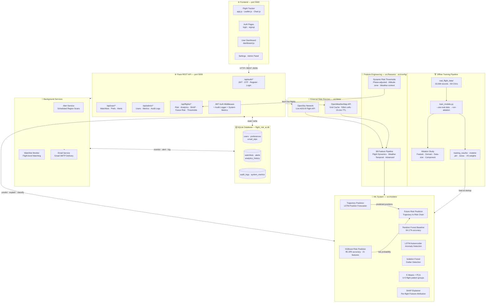

<div align="center">

# ✈️ SkyGuard AI

### Real-Time ML-Powered Flight Risk Monitoring Platform

*Advanced flight safety assessment using 33,568+ real ADS-B records, 7 specialized ML models, and comprehensive web interface*

[](https://www.python.org/)
[](https://www.tensorflow.org/)
[](https://flask.palletsprojects.com/)
[](https://xgboost.readthedocs.io/)

[Features](#-features) • [Quick Start](#-quick-start) • [ML Architecture](#-machine-learning-architecture) • [API Reference](#-api-endpoints) • [Installation](#-installation)

</div>

---

## 📖 Overview

SkyGuard AI is a production-ready flight risk monitoring platform that combines **real OpenSky Network ADS-B data** with **7 specialized machine learning models** to assess flight safety in real-time. The system features a complete web application with authentication, user management, watchlist monitoring, email alerts, interactive analytics dashboards, SHAP explainability, future-trajectory risk forecasting, and dynamic context-aware risk thresholds.

### 🎯 Key Highlights

- Built and validated on raw 33,568 ADS-B observations (32,687 after cleaning) from 17,037 unique flights.
- Primary classifier (XGBoost) achieves 95.19% test accuracy and macro-AUC 0.9888.
- Multi-model pipeline combines classification, anomaly detection, clustering, and future-risk forecasting.
- Context-aware dynamic thresholds and SHAP explanations support interpretable safety decisions.


## ✨ Features
- 🛡️ **95%+ Risk Prediction Accuracy** - XGBoost classifier trained on 33,568 real flight records
- 📡 **Real ADS-B Data** - 17,037 unique flights from OpenSky Network across 59 collection batches
- 🤖 **7 Specialized ML Models** - XGBoost, Random Forest, LSTM Autoencoder, Isolation Forest, K-Means, Trajectory Predictor, Future Risk Predictor
- ☁️ **Weather Integration** - Real-time OpenWeatherMap API with grid-based caching (95%+ hit rate)
- 🔐 **Complete Auth System** - JWT-based authentication with OTP verification, account management
- 📊 **Interactive Dashboards** - Leaflet.js maps + Chart.js visualizations with risk color-coding
- 🔔 **Automated Email Alerts** - Gmail SMTP integration for high-risk flight notifications
- 👥 **Multi-User Platform** - User/admin roles, watchlists, preferences, audit logs, system metrics
- 🎯 **38 Engineered Features** - Flight dynamics, weather conditions, temporal patterns (XGBoost uses 21 features)
- 📈 **Class Weight Balancing** - Handles imbalanced data (66.9% Low, 25.5% Medium, 7.6% High risk)
- 🔮 **Future Risk Forecasting** - LSTM trajectory chain feeds XGBoost for proactive risk scoring
- ⚖️ **Dynamic Risk Thresholds** - Flight-phase, altitude-zone, and weather-context adaptive thresholds
- 🔬 **Ablation Study Framework** - Automated feature, domain, data-size, and model-component ablation

---

## 🏗️ System Architecture



---

## ✨ Features

### 🛡️ Core ML & Safety
- **XGBoost Risk Classification** - 95.19% test accuracy with 95.50% train / 95.33% val / 95.19% test
- **Random Forest Baseline** - 94.17% test accuracy for comparison and validation
- **LSTM Autoencoder** - Reconstruction-based anomaly detection (64→32→64 encoder, 95th-percentile threshold)
- **Isolation Forest** - Statistical outlier detection with 10% contamination threshold
- **K-Means Clustering** - 5-cluster flight pattern segmentation with PCA dimensionality reduction
- **Trajectory Predictor** - LSTM-based position forecasting (128→64 LSTM, 3-step input → 2-step forecast)
- **Future Risk Predictor** - Chains trajectory forecaster → XGBoost for proactive multi-step risk scoring
- **Dynamic Risk Thresholds** - Phase-aware (takeoff 0.85×, landing 0.80×), altitude-zone, and weather-context (thunderstorm 0.75×) adaptive scoring
- **Class Weight Balancing** - Handles imbalanced data: {0: 0.498, 1: 1.306, 2: 4.386}
- **38 Engineered Features** - Flight dynamics, weather conditions, temporal patterns (XGBoost uses 21 features)
- **SHAP Explainability** - Per-flight feature attribution with waterfall plot visualizations

### 📡 Real Data Infrastructure
- **33,568 Real Flight Records** - Collected from OpenSky Network API (59 batches)
- **17,037 Unique Flights** - Global ADS-B data with ICAO24 identifiers
- **Live Flight Tracking** - Real-time OpenSky Network API integration
- **Weather Integration** - OpenWeatherMap API with grid-based caching (50km cells, 15-min TTL)
- **Data Collection Scripts** - Automated data gathering with rate limiting (~30s delay)
- **Multi-Region Support** - India, USA, Europe, China, Japan, Australia, Middle East, South America, Africa, Southeast Asia

### 🔐 Authentication & Security
- **JWT Token System** - Secure stateless authentication with Bearer tokens
- **OTP Verification** - Email-based one-time passwords for account security
- **Password Hashing** - SHA-256 with unique salts per user
- **Account Management** - Deactivation, deletion requests (30-day grace period), cancellation
- **Session Tracking** - Last login timestamps, activity monitoring
- **Role-Based Access Control** - User and Admin roles with different permissions

### 👤 User Features
- **Personal Dashboard** - Statistics, watchlists, alerts, analytics history
- **Watchlist Creation** - Monitor custom regions with ICAO24/coordinates/region definitions
- **Email Alerts** - Automated Gmail notifications for high-risk flights in watchlists
- **User Preferences** - Risk thresholds (LOW/MEDIUM/HIGH), alert frequency (immediate/hourly/daily)
- **Alert History** - View all past notifications with read/unread status
- **Analytics History** - Save and review past query results
- **Account Status** - Check deletion schedule, deactivation status

### ⚙️ Admin Panel
- **User Management** - List users, view details, activate/deactivate, change roles
- **Dashboard Statistics** - Total users, active users, alerts sent, registrations today
- **System Metrics** - API endpoint performance, request counts, average response times
- **Audit Logs** - Complete activity tracking (user, action, resource, timestamp, IP, user agent)
- **Data Export** - CSV export for users, audit logs, system metrics
- **Filtering & Search** - Date ranges, user filtering, endpoint filtering

### 📊 Frontend & Visualization
- **Interactive Map** - Leaflet.js with color-coded risk markers (red=high, orange=medium, green=low)
- **Flight List** - Sortable table with ICAO24, callsign, altitude, speed, risk, anomaly scores
- **Real-time Charts** - Chart.js visualizations:
  - Risk distribution (pie chart)
  - Flight phase distribution (bar chart)
  - Country breakdown (bar chart)
  - Risk by country (grouped bar chart)
- **Weather Indicators** - Temperature, wind speed, visibility, weather condition icons
- **Region Selection** - Dropdown + custom bounding box + current map view + my location
- **SHAP Explainability** - Feature importance visualization for individual flight predictions
- **Responsive Design** - Dark theme with gradient backgrounds and smooth animations

---

## 🚀 Quick Start

Get up and running in 10 minutes!

```bash
# 1. Clone and setup virtual environment
git clone <repository-url>
cd flight-risk-ai
python -m venv venv
venv\Scripts\activate  # Windows
# source venv/bin/activate  # Linux/Mac

# 2. Install dependencies
pip install -r requirements.txt

# 3. Get API keys (required)
# - OpenWeatherMap: https://openweathermap.org/appid (free tier: 1M calls/month)
# - Create config.py from config.example.py and add your API key

# 4. Initialize database and create admin account
python setup.py

 # 5. Train ML models with real data (uses existing 33,568 records, takes ~5-10 minutes)
python train_models.py --use-real-data

# 6. Start Flask backend (Terminal 1)
python src/serving/api.py
# Backend runs on http://localhost:5000

# 7. Start frontend server (Terminal 2)
cd frontend
python -m http.server 5500
# Frontend runs on http://localhost:5500
```

🌐 **Visit http://127.0.0.1:5500/login.html** and login with your admin credentials!

### First Time Usage

1. **Login** with admin account (created during setup)
2. **Fetch flights** - Click "🔄 Fetch Flights" to get live data from OpenSky Network
3. **View analytics** - Click "📊 View Analytics" to see risk distribution and charts
4. **Create watchlist** - Go to Dashboard → Create watchlist for automated monitoring
5. **Enable alerts** - Go to Settings → Enable email alerts for high-risk flights

📚 **[Full Installation Guide](#-installation)** | 🔧 **[Configuration Guide](#-configuration)**

---

## 📸 Screenshots

<div align="center">

### Main Dashboard
*Real-time flight tracking with interactive map and risk indicators*

### Analytics View
*Comprehensive statistics with charts and weather data*

### User Dashboard
*Personal watchlists, alerts, and preferences*

### Admin Panel
*System metrics, user management, and audit logs*

> 💡 **Tip**: Screenshots coming soon! The app features a beautiful dark theme with smooth animations.

</div>

---

## 🛠️ Tech Stack

### Backend
| Technology | Purpose |
|------------|---------|
| Python 3.8+ | Core language |
| Flask | REST API server |
| TensorFlow/Keras | Deep learning models |
| XGBoost | Gradient boosting classifier |
| scikit-learn | ML utilities |
| SQLAlchemy | Database ORM |
| PyJWT | Authentication |
| pandas/NumPy | Data processing |

### Frontend
| Technology | Purpose |
|------------|---------|
| Vanilla JavaScript | Core logic |
| Leaflet.js | Interactive maps |
| Chart.js | Data visualizations |
| HTML5/CSS3 | UI structure |

### External APIs
| Service | Purpose | Free Tier |
|---------|---------|-----------|
| OpenSky Network | Live flight data | ✅ Rate-limited |
| OpenWeatherMap | Weather conditions | ✅ 1M calls/month |

---

## Installation

### Prerequisites

- **Python 3.8+** (tested on 3.8, 3.9, 3.10)
- **8GB RAM** (minimum 6GB for training, 8GB recommended)
- **2GB disk space** (models + data + dependencies)
- **Internet connection** (OpenSky and OpenWeatherMap APIs)

### Step-by-Step Setup

#### 1️⃣ Clone Repository
```bash
git clone <repository-url>
cd flight-risk-ai
```

#### 2️⃣ Create Virtual Environment
```bash
# Windows
python -m venv venv
venv\Scripts\activate

# Linux/Mac
python3 -m venv venv
source venv/bin/activate
```

#### 3️⃣ Install Dependencies
```bash
pip install -r requirements.txt
```

**Dependencies include:**
- `flask` - Web framework
- `flask-cors` - CORS support
- `xgboost` - Gradient boosting
- `tensorflow` - Deep learning
- `scikit-learn` - ML utilities
- `pandas`, `numpy` - Data processing
- `sqlalchemy` - Database ORM
- `pyjwt` - JWT authentication
- `requests` - HTTP client
- `python-dotenv` - Environment variables
- `shap` - Model explainability

#### 4️⃣ Get API Keys

**OpenWeatherMap (Required):**
1. Sign up at [https://openweathermap.org/appid](https://openweathermap.org/appid)
2. Verify email and navigate to API keys section
3. Copy your API key
4. Free tier: **1 million calls/month**, 60 calls/minute
5. Our caching reduces usage to ~5% of limit

**Create `config.py`:**
```bash
# Copy template
cp config.example.py config.py

# Edit config.py and add your API key
OPENWEATHER_API_KEY = "your_api_key_here"
```

#### 5️⃣ Initialize Database
```bash
python setup.py
```

This will:
- Create SQLite database (`flight_risk_ai.db`)
- Initialize all tables (users, watchlists, alerts, preferences, etc.)
- Generate secure JWT secret key in `.env`
- Prompt you to create an admin account
- **Remember your credentials!**

#### 6️⃣ Train ML Models
```bash
 # Train with existing real data (33,568 records)
python train_models.py --use-real-data

# Or collect fresh data first (optional)
python collect_real_data.py --requests 10 --region global
python train_models.py --use-real-data
```

**Training takes ~5-10 minutes and will:**
- Load 33,568 Real Flight Records from `real_flight_data/`
- Engineer 38 features (flight dynamics, weather, advanced patterns)
- Apply class weight balancing
- Train 6 standalone models:
  - XGBoost Risk Predictor (primary)
  - Random Forest Baseline (comparison)
  - LSTM Autoencoder (anomaly detection)
  - Isolation Forest (outlier detection)
  - K-Means Clustering (pattern analysis)
  - Trajectory Predictor (forecasting)
- Enable the Future Risk Predictor as a chained trajectory-to-risk inference pipeline
- Save models to `training_results/` and `models/`
- Generate visualizations and performance reports

Expected output:
```
✓ XGBoost: 95.19% test accuracy
✓ Random Forest: 94.17% test accuracy
✓ LSTM Autoencoder trained (50 epochs)
✓ Models saved to training_results/
```

#### 7️⃣ Start Application

**Terminal 1 - Backend:**
```bash
python src/serving/api.py
```

**Terminal 2 - Frontend:**
```bash
cd frontend
python -m http.server 5500
```

**Access Points:**
- **Frontend**: http://localhost:5500
- **Login**: http://localhost:5500/login.html
- **Backend API**: http://localhost:5000
- **Health Check**: http://localhost:5000/api/health

#### 8️⃣ Optional: Configure Email Alerts

**Get Gmail App Password:**
1. Enable 2-factor authentication on Gmail
2. Go to [Google App Passwords](https://myaccount.google.com/apppasswords)
3. Generate app password for "Mail"
4. Copy the 16-character password

**Add to `.env`:**
```env
SMTP_HOST=smtp.gmail.com
SMTP_PORT=587
SMTP_USER=your-email@gmail.com
SMTP_PASSWORD=your-16-char-app-password
SMTP_FROM_EMAIL=your-email@gmail.com
SMTP_FROM_NAME=SkyGuard AI
ALERT_ENABLED=True
ALERT_CHECK_INTERVAL=300
```

**Test email configuration:**
```bash
curl -X POST http://localhost:5000/api/email/test \
  -H "Authorization: Bearer YOUR_JWT_TOKEN"
```

---

## ⚙️ Configuration

### Environment Variables (`.env`)

Auto-generated by `setup.py`, but you can customize:

```env
# Required
OPENWEATHER_API_KEY=your_openweather_api_key_here
JWT_SECRET_KEY=auto_generated_secure_random_key

# Database
DATABASE_URL=sqlite:///flight_risk_ai.db

# Flask
FLASK_ENV=development
FLASK_DEBUG=True
FLASK_HOST=0.0.0.0
FLASK_PORT=5000

# Email Alerts (Optional)
SMTP_HOST=smtp.gmail.com
SMTP_PORT=587
SMTP_USER=your-email@gmail.com
SMTP_PASSWORD=your-gmail-app-password
SMTP_FROM_EMAIL=your-email@gmail.com
SMTP_FROM_NAME=SkyGuard AI

# Alert Service (Optional)
ALERT_ENABLED=True
ALERT_CHECK_INTERVAL=300
```

### Configuration (`config.py`)

```python
# API Keys
OPENWEATHER_API_KEY = "your_api_key_here"

# ML Model Paths
XGBOOST_MODEL_PATH = "training_results/xgboost_risk_predictor.pkl"
LSTM_AUTOENCODER_PATH = "models/lstm_autoencoder.keras"
TRAJECTORY_PREDICTOR_PATH = "models/trajectory_predictor.keras"
ISOLATION_FOREST_PATH = "training_results/isolation_forest.pkl"
KMEANS_PATH = "training_results/kmeans_clustering.pkl"
SCALER_PATH = "training_results/scaler.pkl"

# API Rate Limiting
OPENSKY_DELAY = 30  # seconds between requests
WEATHER_CACHE_TTL = 900  # 15 minutes
WEATHER_GRID_SIZE = 50000  # 50km grid cells

# Training Parameters
RANDOM_STATE = 42
TEST_SIZE = 0.15
VAL_SIZE = 0.15
```

### Database Schema

**Tables:**
- `users` - User accounts (email, password_hash, role, timestamps)
- `user_preferences` - User settings (alerts, thresholds, regions)
- `watchlists` - Monitored regions/flights (name, type, bbox/icao24)
- `alerts` - Notification history (flight, risk_level, sent_at, read_at)
- `analytics_history` - Saved query results (flights, stats, timestamp)
- `audit_logs` - Activity tracking (user, action, resource, IP)
- `system_metrics` - API performance (endpoint, requests, avg_time)
- `otp_codes` - One-time passwords (email, code, expires_at)

---

## API Endpoints

 ### Authentication (`/api/auth/*`)

 > **Base URL**: `http://localhost:5000` — All authenticated endpoints require `Authorization: Bearer <token>`

 | Method | Endpoint | Auth | Description |
 |--------|----------|------|-------------|
 | POST | `/api/auth/register` | ❌ | Register new user (requires pre-verified OTP) |
 | POST | `/api/auth/login` | ❌ | Login and receive JWT token |
 | GET | `/api/auth/me` | ✅ | Get current user details |
 | PUT | `/api/auth/me` | ✅ | Update user profile |
 | POST | `/api/auth/change-password` | ✅ | Change account password |
 | GET | `/api/auth/verify-token` | ✅ | Verify JWT token validity |
 | POST | `/api/auth/send-otp` | ❌ | Send OTP to email |
 | POST | `/api/auth/verify-otp` | ❌ | Verify OTP code |
 | POST | `/api/auth/resend-otp` | ❌ | Resend OTP code |

 ### User Management (`/api/user/*`)

 | Method | Endpoint | Auth | Description |
 |--------|----------|------|-------------|
 | GET | `/api/user/preferences` | ✅ | Get user preferences |
 | PUT | `/api/user/preferences` | ✅ | Update user preferences |
 | GET | `/api/user/watchlists` | ✅ | List user watchlists |
 | POST | `/api/user/watchlists` | ✅ | Create new watchlist |
 | PUT | `/api/user/watchlists/<id>` | ✅ | Update watchlist |
 | DELETE | `/api/user/watchlists/<id>` | ✅ | Delete watchlist |
 | GET | `/api/user/alerts` | ✅ | List user alerts |
 | POST | `/api/user/alerts/<id>/read` | ✅ | Mark alert as read |
 | GET | `/api/user/analytics-history` | ✅ | Get analytics history |
 | POST | `/api/user/analytics-history` | ✅ | Save analytics query |
 | POST | `/api/user/account/deactivate` | ✅ | Deactivate account |
 | POST | `/api/user/account/request-deletion` | ✅ | Request account deletion (30-day grace) |
 | POST | `/api/user/account/cancel-deletion` | ✅ | Cancel deletion request |
 | GET | `/api/user/account/status` | ✅ | Get account status |

 ### Admin Panel (`/api/admin/*`)

 | Method | Endpoint | Auth | Description |
 |--------|----------|------|-------------|
 | GET | `/api/admin/users` | 🔑 Admin | List all users (paginated, searchable) |
 | GET | `/api/admin/users/<id>` | 🔑 Admin | Get user details + activity stats |
 | POST | `/api/admin/users/<id>/activate` | 🔑 Admin | Activate user account |
 | POST | `/api/admin/users/<id>/deactivate` | 🔑 Admin | Deactivate user account |
 | PUT | `/api/admin/users/<id>/role` | 🔑 Admin | Change user role |
 | GET | `/api/admin/dashboard/stats` | 🔑 Admin | Dashboard statistics |
 | GET | `/api/admin/audit-logs` | 🔑 Admin | Get audit logs (filter by date/user/action) |
 | GET | `/api/admin/system-metrics` | 🔑 Admin | Get API performance metrics |
 | GET | `/api/admin/export/users` | 🔑 Admin | Export users to CSV |

 ### Flight & ML (`/api/*`)

 | Method | Endpoint | Auth | Description |
 |--------|----------|------|-------------|
 | GET | `/api/health` | ❌ | Health check endpoint |
 | GET | `/api/flights` | ✅ | Fetch live flights with full ML scoring |
 | GET | `/api/analytics` | ✅ | Get flight statistics + cluster analysis |
 | GET | `/api/model-status` | ❌ | Check which ML models are loaded |
 | POST | `/api/monitoring/check-watchlists` | ✅ | Manually trigger watchlist monitor |
 | POST | `/api/email/test` | ✅ | Send test alert email |
 | GET/POST | `/api/flights/<icao24>/explain` | ✅ | SHAP feature-importance explanation |
 | GET/POST | `/api/flights/<icao24>/future-risk` | ✅ | Future trajectory risk prediction |
 | GET | `/api/flights/<icao24>/risk-classification` | ✅ | Detailed risk classification breakdown |
 | GET | `/api/thresholds/dynamic` | ✅ | Get context-aware dynamic risk thresholds |

### Request Examples

#### Register New User
```bash
 curl -X POST http://localhost:5000/api/auth/register \
  -H "Content-Type: application/json" \
  -d '{
    "email": "user@example.com",
    "username": "john_doe",
    "password": "SecurePass123",
    "full_name": "John Doe"
  }'
```

#### Login
```bash
 curl -X POST http://localhost:5000/api/auth/login \
  -H "Content-Type: application/json" \
  -d '{
    "username": "john_doe",
    "password": "SecurePass123"
  }'
```

**Response:**
```json
{
  "token": "eyJhbGciOiJIUzI1NiIsInR5cCI6IkpXVCJ9...",
  "user": {
    "id": 1,
    "username": "john_doe",
    "email": "user@example.com",
    "role": "user"
  }
}
```

#### Fetch Flights with ML
```bash
curl -X GET "http://localhost:5000/api/flights?lat_min=6&lat_max=38&lon_min=68&lon_max=98&use_ml=true" \
  -H "Authorization: Bearer YOUR_JWT_TOKEN"
```

**Response:**
```json
{
  "flights": [
    {
      "icao24": "abc123",
      "callsign": "AI101",
      "latitude": 28.5562,
      "longitude": 77.1000,
      "altitude": 10058.4,
      "velocity": 850.2,
      "heading": 45.0,
      "vertical_rate": 0.0,
      "on_ground": false,
      "risk_score": 0.85,
      "risk_level": "HIGH",
      "anomaly_score": 0.12,
      "is_outlier": false,
      "cluster": 2,
      "weather": {
        "temperature": 15.2,
        "wind_speed": 8.5,
        "visibility": 10000,
        "condition": "Clear"
      }
    }
  ],
  "metadata": {
    "total": 1,
    "timestamp": "2026-01-21T12:00:00Z"
  }
}
```

#### Create Watchlist
```bash
curl -X POST http://localhost:5000/api/user/watchlists \
  -H "Authorization: Bearer YOUR_JWT_TOKEN" \
  -H "Content-Type: application/json" \
  -d '{
    "name": "India Monitoring",
    "watch_type": "region",
    "region": "india",
    "risk_threshold": "MEDIUM"
  }'
```

#### Get Analytics
```bash
curl -X GET http://localhost:5000/api/analytics \
  -H "Authorization: Bearer YOUR_JWT_TOKEN"
```

---

## 🤖 Machine Learning Architecture

 ### Models Overview

 The system employs **7 specialized machine learning models**, each serving a distinct purpose (not a voting ensemble):

 | Model | Type | Test Accuracy | Purpose | Technology |
 |-------|------|---------------|---------|------------|
 | **XGBoost** | Gradient Boosting | **95.19%** | Primary risk classification (21 features) | XGBoost 2.x |
 | **Random Forest** | Ensemble Trees | **94.17%** | Baseline comparison | scikit-learn |
 | **LSTM Autoencoder** | Deep Learning | 95th percentile threshold | Anomaly detection — time-series | TensorFlow/Keras |
 | **Isolation Forest** | Tree-based | 10% contamination | Outlier detection — statistical | scikit-learn |
 | **K-Means + PCA** | Clustering | 5 clusters, 10 PCA components | Flight pattern segmentation | scikit-learn |
 | **Trajectory Predictor** | LSTM | MAE metric | 3-step input → 2-step position forecast | TensorFlow/Keras |
 | **Future Risk Predictor** | LSTM + XGBoost | Chained pipeline | Proactive multi-step risk scoring | TensorFlow + XGBoost |

### XGBoost Risk Predictor (Primary Model)

### Risk Score Formulation

For a flight observation $f$ (single ADS-B feature vector), the classifier returns posterior probabilities
$\hat{P}_L(f)$, $\hat{P}_M(f)$, and $\hat{P}_H(f)$ for LOW, MEDIUM, and HIGH risk, with
$\hat{P}_L(f)+\hat{P}_M(f)+\hat{P}_H(f)=1$.

The continuous composite score is:

$$
S(f) = 0\cdot\hat{P}_L(f) + 0.5\cdot\hat{P}_M(f) + 1.0\cdot\hat{P}_H(f), \quad S(f)\in[0,1].
$$

The discrete label is assigned with context-dependent thresholds $\tau_1(c_f)$ and $\tau_2(c_f)$
($0 \le \tau_1(c_f) < \tau_2(c_f) \le 1$):

$$
L(f)=
\begin{cases}
\mathrm{HIGH}, & S(f)\ge\tau_2(c_f)\\
\mathrm{MEDIUM}, & \tau_1(c_f)\le S(f)<\tau_2(c_f)\\
\mathrm{LOW}, & S(f)<\tau_1(c_f)
\end{cases}
$$

where $c_f$ is the context tuple (flight phase, altitude zone, weather condition).

**Architecture:**
```python
n_estimators=150        # Number of boosting rounds
max_depth=3             # Tree depth (shallow for generalization)
learning_rate=0.01      # Slow learning for stability
subsample=0.6           # 60% row sampling per tree
colsample_bytree=0.6    # 60% column sampling per tree
gamma=0.5               # Minimum loss reduction for splits
reg_alpha=0.2           # L1 regularization
reg_lambda=3.0          # L2 regularization (strong)
```

**Performance:**
- **Training**: 95.50% accuracy (22,880 samples)
- **Validation**: 95.33% accuracy (4,903 samples)
- **Test**: 95.19% accuracy (4,904 samples)
- **Overfitting Gap**: 0.31% (excellent generalization)
- **F1-Score**: 0.6516 (10-fold cross-validation)

**Training Methodology:**
- **Data Split**: 70% train / 15% val / 15% test (random_state=42 for train, 43 for val/test)
- **Class Balancing**: Class weight balancing (not SMOTE) with weights {0: 0.498, 1: 1.306, 2: 4.386}
- **Early Stopping**: 40 rounds patience on validation accuracy
- **Regularization**: Strong L1+L2 penalties + depth constraints + sampling

### Random Forest Baseline

**Architecture:**
```python
n_estimators=150           # Number of trees
max_depth=3                # Shallow trees
min_samples_split=47       # Minimum samples to split
min_samples_leaf=19        # Minimum samples per leaf
max_features=0.6           # 60% feature sampling
max_samples=0.6            # 60% row sampling (bagging)
min_impurity_decrease=0.018  # Minimum impurity decrease
```

**Performance:**
- **Training**: 94.28% accuracy
- **Validation**: 94.33% accuracy
- **Test**: 94.17% accuracy
- **F1-Score**: 0.9403 (10-fold cross-validation)

 ### Deep Learning Models

 **LSTM Autoencoder (Anomaly Detection):**
 - **Input**: Time-series sequences (10 timesteps × 8 features)
 - **Architecture**: 2-layer LSTM encoder (64→32 units) + 2-layer LSTM decoder (32→64 units)
 - **Training**: 63 epochs (early stopping), batch_size=32, MAE loss, Adam optimizer
 - **Detection**: Reconstruction error > 95th percentile threshold (stored in `lstm_threshold.pkl`)
 - **Use Case**: Detect unusual flight patterns in temporal data

 **Trajectory Predictor (Forecasting):**
 - **Input**: 3-step position sequences (lat, lon, altitude)
 - **Architecture**: 128→64 stacked LSTM layers for sequential prediction
 - **Output**: 2-step future position forecast
 - **Training**: 91 epochs (early stopping), batch_size=32, MSE loss
 - **Use Case**: Predict future flight paths; feeds into Future Risk Predictor

 **Future Risk Predictor (Chained Pipeline):**
 - **Architecture**: Trajectory Predictor LSTM → feature reconstruction → XGBoost scoring
 - **Input**: Current flight state (position, velocity, heading, altitude)
 - **Output**: Risk probability for each predicted future position
 - **Use Case**: Proactive risk scoring — anticipate emerging threats before they materialise
 - **Endpoint**: `GET/POST /api/flights/<icao24>/future-risk`

 ### Feature Engineering (38 Features Total, XGBoost uses 21)

**Flight Dynamics (11 features):**
1. `velocity` - Ground speed in m/s
2. `acceleration` - Rate of velocity change
3. `velocity_variation` - Standard deviation of recent speeds
4. `altitude_change_rate` - Vertical speed
5. `altitude_stability` - Consistency of altitude
6. `altitude_bin` - Categorical altitude ranges (0-5)
7. `heading_change` - Direction change rate
8. `turn_rate` - Angular velocity
9. `is_turning` - Boolean turn indicator
10. `time_since_update` - Data freshness
11. `velocity_change_rate` - Jerk (acceleration derivative)

**Weather Conditions (10 features):**
12. `temperature` - Altitude-adjusted temperature (°C)
13. `wind_speed` - Wind velocity (m/s)
14. `wind_direction` - Wind heading (degrees)
15. `crosswind` - Perpendicular wind component
16. `headwind` - Parallel wind component
17. `visibility` - Visual range (meters)
18. `weather_risk_score` - Composite risk (0-100)
19. `high_wind` - Boolean flag (>15 m/s)
20. `low_visibility` - Boolean flag (<5000m)
21. `icing_conditions` - Boolean flag (-20°C to 0°C at altitude)

 **Removed Features:**
 - `severe_weather` - Removed due to zero variance (all zeros in dataset)

 ### Dynamic Risk Thresholds (`src/config/risk_thresholds.py`)

 Risk thresholds are adaptive and context-aware — the same numerical score may produce different risk labels depending on flight context:

 | Context | Multiplier | Effect |
 |---------|-----------|--------|
 | Takeoff phase | 0.85× | Lower threshold → more sensitive |
 | Landing phase | 0.80× | Lower threshold → most sensitive |
 | High altitude (>10,000m) | 1.10× | Higher threshold → less sensitive |
 | Low altitude (<500m) on ground | 0.90× | Lower threshold → more sensitive |
 | Thunderstorm weather | 0.75× | Much lower threshold → maximum sensitivity |
 | Heavy rain / snow | 0.90× | Lower threshold → more sensitive |

 Access current thresholds via `GET /api/thresholds/dynamic`.

 ### Ablation Study Framework

 Training supports automated ablation analysis via `--run-ablation` flag:

 ```bash
 python train_models.py --use-real-data --run-ablation
 ```

 Results stored per session in `training_results/session_<timestamp>/ablation_study/`:
 - **Feature ablation** — measure accuracy drop when each feature is removed
 - **Domain ablation** — remove entire feature groups (flight, weather, temporal)
 - **Data-size ablation** — train on 10%, 25%, 50%, 75%, 100% of data
 - **Component ablation** — measure impact of each ML model on overall pipeline

 ### Training Data Statistics

 **Real Flight Data Collection (Latest Session: 2026-03-12):**
 - **Total Records**: 33,568 flight observations
 - **Unique Flights**: 17,037 individual flights (tracked by ICAO24)
 - **Collection Batches**: 59 CSV files (global data collection)
 - **Data Source**: OpenSky Network ADS-B real-time API
 - **Collection Period**: January–March 2026
 - **Regions Covered**: Worldwide (global data collection mode)
 - **Dataset Contributors**: Karthika Natarajan, K Aravind, Golla Jyothika

**Class Distribution (cleaned dataset):**
- **Class 0 (Low Risk)**: 66.9% of samples
- **Class 1 (Medium Risk)**: 25.5% of samples
- **Class 2 (High Risk)**: 7.6% of samples
- **Balancing Method**: Class weight balancing (not synthetic oversampling)

**Data Splits:**
- **Training Set**: 22,880 samples (70%)
- **Validation Set**: 4,903 samples (15%)
- **Test Set**: 4,904 samples (15%)
- **Stratification**: Maintains class distribution across splits

### Model Inference Pipeline

```python
# 1. Load models from disk (cached in memory after first load)
inference_service = InferenceService()

# 2. Fetch live flight data
flights = fetch_flights(bbox=(6, 38, 68, 98))  # India region

# 3. Build features (38 features total: flight dynamics + weather + advanced patterns)
featured_flights = build_featured_flights(flights, weather_service)

# 4. ML predictions
for flight in featured_flights:
    # Primary risk classification
    risk_prob, risk_level = inference_service.predict_risk(flight.features)
    
    # Anomaly detection
    anomaly_score = inference_service.predict_anomaly(flight.sequence)
    is_outlier = inference_service.predict_outlier(flight.features)
    
    # Pattern analysis
    cluster = inference_service.predict_cluster(flight.features)
    
    # Trajectory forecasting
    future_positions = inference_service.predict_trajectory(flight.sequence)

# 5. Return results to frontend
```

### SHAP Explainability

The system uses **SHAP (SHapley Additive exPlanations)** to explain individual predictions:

- **Feature Importance**: Which features contributed most to each prediction
- **Directionality**: Whether features pushed risk higher or lower
- **Visualization**: Waterfall plots for per-flight explanations
- **Access**: Available via `/api/flights/<icao24>/explain` endpoint

---

## Data Collection & Management

### Real Flight Data Collection

The project includes automated scripts for collecting real ADS-B data from OpenSky Network:

**Collection Script:**
```bash
# Collect global flight data (10 batches, 30s delay)
python collect_real_data.py --requests 10 --region global

# Collect specific region data
python collect_real_data.py --requests 10 --region india
python collect_real_data.py --requests 10 --region usa
python collect_real_data.py --requests 10 --region europe

# High-risk flight collection
python collect_high_risk_data.py --requests 10

# Medium-risk flight collection
python collect_medium_risk_data.py --requests 10
```

**Supported Regions:**
- `india` - Indian subcontinent (6°N-38°N, 68°E-98°E)
- `usa_east` - US East Coast (25°N-50°N, 100°W-65°W)
- `usa_west` - US West Coast (30°N-50°N, 125°W-100°W)
- `europe` - European continent (35°N-70°N, 15°W-40°E)
- `china` - Chinese mainland (20°N-50°N, 70°E-135°E)
- `japan` - Japanese islands (30°N-45°N, 125°E-150°E)
- `australia` - Australian continent (45°S-10°S, 110°E-160°E)
- `south_america` - South America (55°S-12°N, 82°W-34°W)
- `middle_east` - Middle East (12°N-42°N, 25°E-65°E)
- `africa` - African continent (35°S-37°N, 18°W-52°E)
- `global` - Worldwide (no region restriction)

**Data Format:**
Each CSV file contains:
- `icao24` - Aircraft unique identifier
- `callsign` - Flight callsign
- `origin_country` - Aircraft country of origin
- `latitude`, `longitude` - Geographic coordinates
- `baro_altitude` - Barometric altitude (meters)
- `velocity` - Ground speed (m/s)
- `heading` - Track angle (degrees)
- `vertical_rate` - Vertical speed (m/s)
- `on_ground` - Ground status (boolean)
- `timestamp` - Unix timestamp
- Weather fields (temperature, wind_speed, etc.)

**Collection Statistics (Existing Data):**
- **Total Files**: 59 CSV files
- **Total Records**: 32,687 flight observations
- **Unique Flights**: 17,037 distinct ICAO24 identifiers
- **Date Range**: January 2026 (multiple collection batches)
- **Coverage**: Global (mix of all regions)

### Data Validation Scripts

**Check data integrity:**
```bash
# Validate training data
python check_data.py

# Verify feature engineering
python check_features.py

# Test weather API integration
python check_weather_data.py

# Test OpenWeather API key
python test_api_key.py

# Validate model accuracy
python test_real_data_accuracy.py
```

### Database Management

**Initialize database:**
```bash
python setup.py
```

**Migrate database schema:**
```bash
python migrate_database.py
```

**Cleanup expired accounts:**
```bash
# Run manually or as cron job
python cleanup_expired_accounts.py
```

### Training Data Pipeline

```python
# 1. Data Collection
collect_real_data.py → real_flight_data/*.csv (32,687 records)

# 2. Feature Engineering
build_features.py → 21 engineered features

# 3. Preprocessing
train_models.py → data cleaning, splitting, scaling

# 4. Model Training
train_models.py → 6 ML models (XGBoost, RF, LSTM, etc.)

# 5. Model Persistence
training_results/xgboost_risk_predictor.pkl
training_results/random_forest_baseline.pkl
models/lstm_autoencoder.keras
models/trajectory_predictor.keras
```

---

## Project Structure

```
flight-risk-ai/
│
├── 📄 README.md                      # This file
├── 📄 DOCUMENTATION.md              # Detailed documentation
├── 📄 requirements.txt              # Python dependencies
├── 📄 config.py                     # API keys and configuration
├── 📄 config.example.py             # Configuration template
├── 📄 setup.py                      # Database initialization
├── 📄 .env                          # Environment variables (auto-generated)
│
├── 📄 train_models.py               # Main training script (entry point)
├── 📄 research_analysis.py          # Random Forest baseline training
├── 📄 ablation_study.py             # Feature ablation analysis
│
├── 📄 collect_real_data.py          # OpenSky data collection script
├── 📄 collect_high_risk_data.py     # High-risk flight collector
├── 📄 collect_medium_risk_data.py   # Medium-risk flight collector
├── 📄 check_data.py                 # Data validation script
├── 📄 check_features.py             # Feature engineering checker
├── 📄 check_weather_data.py         # Weather API tester
│
├── 📄 test_api_key.py               # OpenWeather API tester
├── 📄 test_real_data_accuracy.py    # Model accuracy validator
├── 📄 cleanup_expired_accounts.py   # Account cleanup cron job
├── 📄 migrate_database.py           # Database migration script
│
├── 📂 src/                          # Backend source code
│   ├── 📄 __init__.py
│   │
│   ├── 📂 auth/                     # Authentication system
│   │   ├── 📄 __init__.py
│   │   ├── 📄 routes.py             # Auth endpoints (register, login, OTP)
│   │   └── 📄 jwt_utils.py          # JWT token utilities
│   │
│   ├── 📂 user/                     # User management
│   │   ├── 📄 __init__.py
│   │   └── 📄 routes.py             # User endpoints (preferences, watchlists, alerts)
│   │
│   ├── 📂 admin/                    # Admin panel
│   │   ├── 📄 __init__.py
│   │   └── 📄 routes.py             # Admin endpoints (users, metrics, audit logs)
│   │
│   ├── 📂 database/                 # Database models
│   │   ├── 📄 __init__.py
│   │   └── 📄 models.py             # SQLAlchemy models (User, Watchlist, Alert, etc.)
│   │
 │   ├── 📂 config/                   # Configuration modules
 │   │   ├── 📄 __init__.py
 │   │   └── 📄 risk_thresholds.py    # Dynamic risk threshold rules (phase/altitude/weather)
 │   │
 │   ├── 📂 data/                     # Data fetching & preprocessing
 │   │   ├── 📄 __init__.py
 │   │   ├── 📄 fetch_opensky.py      # OpenSky Network API client
 │   │   ├── 📄 fetch_weather.py      # OpenWeatherMap API client
 │   │   ├── 📄 weather_cache.py      # Grid-based weather cache (50km cells, 15-min TTL)
 │   │   └── 📄 preprocessing.py      # Data normalisation and scaling utilities
 │   │
 │   ├── 📂 features/                 # Feature engineering
 │   │   ├── 📄 __init__.py
 │   │   └── 📄 build_features.py     # 38-feature construction pipeline
 │   │
 │   ├── 📂 models/                   # ML models
 │   │   ├── 📄 __init__.py
 │   │   ├── 📄 risk_predictor.py     # XGBoost risk classifier
 │   │   ├── 📄 lstm_autoencoder.py   # LSTM anomaly detector
 │   │   ├── 📄 isolation_forest.py   # Outlier detector
 │   │   ├── 📄 clustering.py         # K-Means + PCA clustering
 │   │   ├── 📄 trajectory_predictor.py  # LSTM trajectory forecaster
 │   │   ├── 📄 future_risk_predictor.py # Chained trajectory→risk pipeline (NEW)
 │   │   └── 📄 inference.py          # Unified inference service
│   │
│   ├── 📂 monitoring/               # Watchlist monitoring
│   │   ├── 📄 __init__.py
│   │   └── 📄 watchlist_monitor.py  # Automated monitoring service
│   │
│   ├── 📂 email/                    # Email notifications
│   │   ├── 📄 __init__.py
│   │   └── 📄 email_service.py      # Gmail SMTP service
│   │
│   ├── 📂 serving/                  # API server
│   │   ├── 📄 __init__.py
│   │   └── 📄 api.py                # Flask REST API (main server)
│   │
│   ├── 📂 services/                 # Background services
│   │   ├── 📄 __init__.py
│   │   └── 📄 alert_service.py      # Alert scheduling service
│   │
 │   └── 📂 utils/                    # Training utilities
 │       ├── 📄 __init__.py
 │       ├── 📄 train_models.py       # Training orchestration pipeline
 │       └── 📄 training_logger.py    # Structured per-session training logger
│
├── 📂 frontend/                     # Web interface
│   ├── 📄 index.html                # Main application page
│   ├── 📄 app.js                    # Main JavaScript logic
│   ├── 📄 styles.css                # Global styles
│   │
│   ├── 📄 login.html                # Login page
│   ├── 📄 signup.html               # Registration page
│   ├── 📄 auth.js                   # Auth page logic
│   ├── 📄 auth-styles.css           # Auth page styles
│   │
│   ├── 📄 dashboard.html            # User dashboard
│   ├── 📄 dashboard.js              # Dashboard logic
│   │
│   ├── 📄 settings.html             # User settings
│   ├── 📄 settings.js               # Settings logic
│   │
│   ├── 📄 admin.html                # Admin panel
│   ├── 📄 admin.js                  # Admin panel logic
│   │
│   └── 📂 images/                   # Static assets
│       └── 📄 logo.png              # Application logo
│
 ├── 📂 models/                       # Trained ML models (auto-generated)
 │   ├── 📄 README.md                 # Model documentation
 │   ├── 📄 risk_predictor.pkl        # XGBoost primary model
 │   ├── 📄 isolation_forest.pkl      # Isolation Forest weights
 │   ├── 📄 flight_clusterer.pkl      # K-Means + PCA clustering model
 │   ├── 📄 lstm_threshold.pkl        # LSTM autoencoder anomaly threshold
 │   ├── 📄 lstm_autoencoder.keras    # LSTM autoencoder weights
 │   ├── 📄 lstm_autoencoder.h5       # Legacy Keras format
 │   └── 📄 trajectory_predictor.keras  # Trajectory LSTM weights
 │
 ├── 📂 real_flight_data/             # Real ADS-B data (33,568 records)
 │   ├── 📄 global_20260111_124902.csv
 │   ├── 📄 global_20260111_125046.csv
 │   ├── 📄 global_20260115_134555.csv
 │   └── ... (59 CSV files total)
 │
 ├── 📂 training_results/             # Training outputs (auto-generated, per-session)
 │   └── 📂 session_<timestamp>/
 │       ├── 📄 SUMMARY_REPORT.md     # Human-readable training summary
 │       ├── 📄 training_results.json # Machine-readable metrics
 │       ├── 📄 advanced_metrics.json # Detailed per-class metrics
 │       ├── 📄 training_data.pkl     # Preprocessed training data snapshot
 │       ├── 📄 feature_importance.png
 │       ├── 📄 roc_pr_curves.png
 │       ├── 📄 *_confusion_matrix.png
 │       ├── 📄 *_training_history.png
 │       └── 📂 ablation_study/       # Ablation results (if --run-ablation)
 │           ├── 📄 ABLATION_STUDY_SUMMARY.md
 │           ├── 📄 feature_ablation_results.csv
 │           ├── 📄 feature_domain_ablation.csv
 │           ├── 📄 data_ablation_results.csv
 │           └── 📄 model_component_summary.csv
│
├── 📂 Documents/                    # Project documentation (excluded)
│   ├── 📄 ieee.tex                  # IEEE paper LaTeX
│   ├── 📄 onepage.md                # One-page summary
│   ├── 📄 Project Proposal.md       # Project proposal
│   └── 📂 paper text files/         # Research papers
│
└── 📄 flight_risk_ai.db             # SQLite database (generated)
```

 ### Key Directories Explained

 - **`src/`** - All backend Python code organized by functionality
 - **`src/config/`** - Dynamic risk threshold rules and configuration
 - **`src/data/`** - OpenSky + OpenWeatherMap API clients, preprocessing, weather cache
 - **`src/models/`** - All 7 ML model classes including `future_risk_predictor.py`
 - **`frontend/`** - Complete web interface with authentication and dashboards
 - **`models/`** - Saved model artefacts loaded at API startup (`.pkl`, `.keras`, `.h5`)
 - **`training_results/`** - Per-session training outputs, metrics, and ablation reports
 - **`real_flight_data/`** - 33,568 real ADS-B records from OpenSky Network (59 CSVs)
 - **Root scripts** - Training, data collection, testing, and setup utilities

---

## 🚨 Important Notes

### Data & Accuracy
- ✅ **Trained on 33,568 Real Flight Records** from OpenSky Network
- ✅ **95%+ test accuracy** on real ADS-B data
- ⚠️ **Research/educational project** - not certified for aviation safety decisions
- ⚠️ **Real-time predictions only** - does not replace professional flight risk assessment
- 💡 **For production**: Collect more diverse data, retrain regularly, implement monitoring

### API Rate Limits
- **OpenSky Network**: ~100-400 requests/hour depending on server load (wait 30-60s between requests)
- **OpenWeatherMap Free Tier**: 60 calls/min, 1M calls/month
  - Our grid caching reduces calls to ~5% of limit
  - Cache: 50km cells, 15-minute TTL
  - Typical usage: ~500-1000 calls/day

### Performance Considerations
- **First request**: 3-5 seconds (model loading from disk)
- **Subsequent requests**: <1 second (models cached in memory)
- **Region size**: Smaller bounding boxes = faster response times
- **Weather caching**: 95%+ hit rate for consecutive requests
- **Database**: SQLite suitable for <10K users, consider PostgreSQL for production

### Known Limitations
- OpenSky API may have coverage gaps in certain regions
- Weather data accuracy depends on OpenWeatherMap station density
- Model trained primarily on global data (may need regional fine-tuning)
- Email alerts require valid Gmail credentials (2FA + app password)

---

## 🤝 Contributing

Contributions are welcome! Here's how you can help:

### Priority Areas
- 🔬 **Data Collection** - Expand real flight dataset to 100K+ samples
- 🤖 **Model Improvements** - Experiment with Transformers, GNN, or ensemble methods
- 🎨 **Frontend Enhancement** - Improve visualizations, add heatmaps, trajectory animations
- 🔄 **Real-time Features** - WebSocket integration for live flight updates
- 📱 **Mobile Support** - Responsive design improvements or native mobile app
- 🧪 **Testing Suite** - Unit tests, integration tests, end-to-end tests
- 📚 **Documentation** - Tutorials, deployment guides, API client libraries
- 🌍 **Internationalization** - Multi-language support
- 🔒 **Security** - OAuth integration, rate limiting, RBAC enhancements

### Development Workflow
1. **Fork** the repository
2. **Create branch**: `git checkout -b feature/your-feature`
3. **Make changes**: Follow existing code style (PEP 8 for Python)
4. **Test locally**: Ensure training and API work
5. **Commit**: `git commit -m 'Add: brief description'`
6. **Push**: `git push origin feature/your-feature`
7. **Pull Request**: Open PR with detailed description

### Code Style
- **Python**: PEP 8, type hints where applicable
- **JavaScript**: ES6+, consistent formatting
- **Comments**: Explain "why", not "what"
- **Documentation**: Update README and DOCUMENTATION.md for significant changes

---

## 📝 License & Legal

This project is for **educational, research, and demonstration purposes**.

### Data Sources
- **OpenSky Network**: Subject to their [terms of use](https://opensky-network.org/about/terms-of-use)
  - Attribution required for published research
  - Rate limiting must be respected
- **OpenWeatherMap**: Subject to their [terms](https://openweathermap.org/terms)
  - Free tier limitations apply
  - Proper API key usage required

### Disclaimer
This software is provided "as is" without warranty. It is **not certified** for:
- Real-time aviation safety decisions
- Flight planning or navigation
- Emergency response systems
- Commercial aviation operations

Always consult certified aviation authorities and systems for safety-critical decisions.

---

## 🙏 Acknowledgments

### Project Contributors
- Karthika Natarajan
- K Aravind
- Golla Jyothika

- **OpenSky Network** - Providing free, crowdsourced ADS-B flight data
- **OpenWeatherMap** - Comprehensive weather API with generous free tier
- **TensorFlow/Keras** - Powerful deep learning framework for LSTM models
- **XGBoost** - High-performance gradient boosting implementation
- **scikit-learn** - Essential machine learning utilities and models
- **Flask** - Lightweight and flexible web framework
- **Leaflet.js** - Interactive map visualizations
- **Chart.js** - Beautiful and responsive chart library

**Special thanks to the aviation data community for making real-time flight tracking accessible!**

---

## 📞 Support & Resources

### Documentation
- 📖 **Detailed Guide**: [DOCUMENTATION.md](DOCUMENTATION.md) (if available)
- 📄 **Training Fixes**: [TRAINING_FIX_SUMMARY.md](TRAINING_FIX_SUMMARY.md)
- 📄 **Weather Report**: [WEATHER_VERIFICATION_REPORT.md](WEATHER_VERIFICATION_REPORT.md)
- 📄 **Quick Start**: [QUICK_START.md](QUICK_START.md)

### Community & Help
- 🐛 **Bug Reports**: Open an issue with `bug` label
- 💡 **Feature Requests**: Open an issue with `enhancement` label
- 💬 **Questions**: Open a discussion in GitHub Discussions
- 📧 **Contact**: [Create an issue](https://github.com/your-repo/issues) for inquiries

---

<div align="center">

**Built with Python, TensorFlow, XGBoost, Flask, and modern web technologies**

**Trained on 33,568 Real Flight Records from OpenSky Network**

⭐ **Star this repo** if you find it useful!

[⬆ Back to Top](#-skyguard-ai)

---

 *Last Updated: March 25, 2026 | Version 2.1*

</div>


